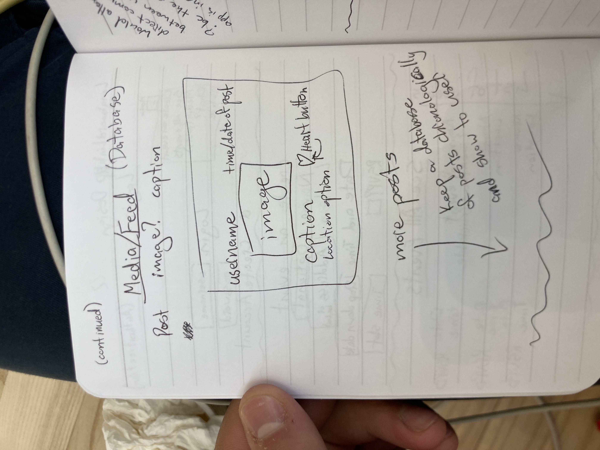

# This is the README file for LongboardLinkup
## LongboardLinkup is a web app designed to help longboarders meet up and plan events in Provo, UT.
Part of this inspiration comes from the Spikeball app, which allows players 
to meet up and see what events are going on near them

## Description
### Elevator Pitch
This is the place to find other people near you who are longboarding! Riding around for transportation is all good and fun, but there is so much more potential in your board just waiting to be unlocked. Social interactions are key to personal development, as is making progress on your personal goals. Physical exercise stimulates the brain and promotes longevity and quality of life. Spending time outdoors and moving is good for your mental health. Why not augemnt and share these amazing benefits through a LongboardLinkup? See what events are going on around you, or plan one yourself. Make new friends and coordinate schedules for even more fun 👍

### Design
The "Login", "Create" and "Events" screens

The "Feed" screen that shows posts from users

A design for a "Chat" feauture that I might add to the app, 
plus the websocket I will employ

### Key Features
1. HTTPS for secure login
2. Profile information (including username and password) and persistently stored.
3. Ability to create a new boarding event, showing location, date and time.
4. Ability to veiw all upcoming events.
5. Events are persistantly stored.
6. Ability to create and share posts about the events you have attended.
7. Ability to chat with other users for more information about upcoming events.
8. Display of current "featured" board, rider, company, deal or other notice.

## Technologies

I will use the required technologies in these ways.

* __HTML__ - Uses correct HTML structure for application. At least 4 HTML pages for login, events, event creation and posts from other users. Hyperlinks to these pages. 
* __CSS__ - Application styling so that it looks good on different screen sizes, uses whitespace and color well, and has consistency of format between pages.
* __JavaScript__ - Provides login, choice display, liking posts, creating events, RSVPing to events, and more.
* __Service__ - Backend service with endpoints for:
  * login
  * retrieving events
  * submitting events
  * retriving posts
  * submitting posts
* __DB__ - Store user profiles, events, and posts in database.
* __Login__ - Register and login users. Credentials securely stored in database. Can't vote unless authenticated.
* __WebSocket__ - A "featured" longboard-related thing will be hooked up to the login page. 
* __React__ - Application ported to use the React web framework.