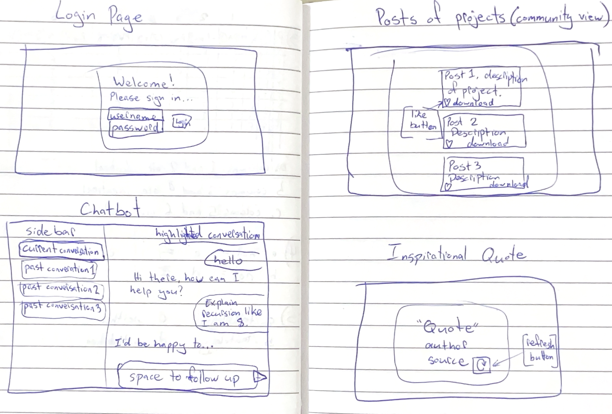

# startup
A repo for my startup, Focused Coding
BYU course instruction found here: https://github.com/webprogramming260/.github/blob/main/profile/instructionTopics.md

## Elevator Pitch
Meet the ***Focused Coding*** online community interface! This fun, interactive website has a chatbot designed to guide young Computer Science students through challenging concepts and projects. With a clean chat interface and easy access to recent conversations for review, the bot uses natural language to clarify tough topics, provide constructive feedback on code, and offer abstract examples - all without doing the work in the student's place! Features include inspirational programming quotes refreshed via API, a project showcase to celebrate peer achievements, and a secure login for a personalized experience. It’s an application for fostering **creativity**, **community**, and **focus**!

## Diagrams

## More detailed description

This will be a fun, AI chatbot meant to interact with young Computer Science students. The chat feature will have a main portion with the current chat, as well as the most recent chats available to click on at the side of the screen. These old chats will be for examination only, not meant to continue the conversation with the bot.

The chatbot will be prompted to respond to questions the student has about CS, helping him/her understand any topics that may be confusing, or that he/she needs more practice with.

The bot will avoid giving a student code to complete his/her projects, opting to instead use natural language to guide the student's programming, reviewing and giving comments on code the student has written, and, in cases where these strategies are not enough, providing abstract code examples of the topic in question.

The purpose of this bot is to help provide young CS students with 24-7 access to a "tutor" who can help them with homework and/or personal projects. The bot will challenge students to apply their budding skills by answering questions and guiding without doing any of the work for the student.

The application will also include other features, such as:

- A programming related inspirational quote. The page will have a refresh button to get a new quote. This will be an API call.

- A page where approved projects from fellow students are posted and available for each student to check-out. This will build a sense of community as students are able to see the work their peers are completing. Students will be able to download the code from these projects, as well as "like" the post.

- A login screen.

## Technologies I will use:
- **HTML** - Uses correct HTML structure for application. Four HTML pages. One for login, one for chatting with the bot, one for viewing recent posts of students' projects, and one for viewing a programming-related inspirational quote.
- **CSS** - Application styling that looks good on different screen sizes, uses good whitespace, color choice and contrast. Little animations on the login and quote pages to make them more visually appealing.
- **React** - Provides login, previous chat display, handles API requests and responses to ChatGPT, display posts of others' projects, backend endpoint calls. Single page application with views componentized and reactive to user's actions.
- **Service** - Backend service with endpoints for:
  - logging in with username and password
  - retrieving old chats (based on user)
  - saving current chat
  - retrieving posts
  - adding new posts
  - displayed a random quote using the https://programming-quotes-api.azurewebsites.net/api/quotes/random API
- **DB/Login** - Store users, chats, and posts in database. Register and login users. Credentials securely stored in database. Can't chat with bot or view posts unless authenticated.
- **WebSocket** - As soon as a new project is posted, all users can see the post get added to the feed.

## Deliverables

### AWS
I followed the instructions and got some help from Dr. Jensen when I was stuck. I'll continue to reach out when I feel I need help.

### HTML
For this deliverable I did the following.
- [x] **HTML pages** - Four different pages. One for each view. `index.html` (Login), `chat.html`, `posts.html`, and `quote.html`.
- [x] **Proper HTML element usage** - I learned about elements. I used header, footer, main, nav, img, a, input, button, form, div, and more.
- [x] **Links** - Links between views.
- [x] **Text** - Each page has text.
- [x] **3rd party API placeholder** - Quote page has a place to display an inspirational quote and author.
- [x] **Images** - Simple image currently displayed on `index.html`.
- [x] **Login placeholder** - Placeholder for auth on the login page.
- [x] **DB data placeholder** - Posts placeholder on the posts page.
- [x] **WebSocket placeholder** - Real-time updates when number of likes on a post updates.

### CSS
For this deliverable I did the following.
- [x] **Header, footer, and main content body** - I used a common CSS file to style these `styles.css`. This applies to all four of my `.html` pages to be simpler than having separate `.css` files for each.
- [x] **Navigation elements** - Fairly basic navigation style. Resizes to column style when page is tight.
- [x] **Responsive to window resizing** - Navigation goes vertical when width is small. My favorite is that the "Recent Chats" disappears when the screen size ration is less than 4/5.
- [x] **Application elements** - I used a lot of `display:flex` to get things to align correctly. I'm particularly pleased with the simple but elegant layout of the posts page.
- [x] **Application text content** - Set all my text to Arial (sans-serif) and it looks nice, if a little boring. I might upgrade it later.
- [x] **Application images** - I left the about image as is. It's also pretty boring. I will probably upgrade that soon too.

## React part 1: Routing deliverable

For this deliverable I did the following.

- [x] **Bundled using Vite** - It was easy to install and use Vite. I really appreciated how it sped up the deployment process too!
- [x] **Components** - It was simple to bring the code over from HTML and CSS. I had to rework them quite a bit, but Dr. Jensen's video was very helpful for this.
- [x] **Router** - While creating the component routing was fairly straightforward, I'm not 100% sure I understood it. I will make sure to keep paying attention to what that is doing as I move into part 2 of React and JS.

## React part 2: Reactivity

For this deliverable I did the following.

- [x] **All functionality implemented or mocked out** - Mostly using local storage to store username, posts, likes and such. WebSocket is mocked up with a `getPosts` function. I'm especially pleased by the AI that is working (nearly) perfectly! I just need to make sure it is sending the context of a chat to the server (which it is not doing quite yet).
- [x] **Hooks** - Extensive use of `useEffect` and `useState`. I think it is in just about every `.jsx` file. They are quite useful!

## Service deliverable

For this deliverable I did the following.

- [x] **Node.js/Express HTTP service** - Installed Express with NPM. Default port on 4000.js`.
- [x] **Static middleware for frontend** - Simple endpoints in `service/index.js`.
- [x] **Calls to third party endpoints** - Chat gets AI responses from OpenRouter API (third party)
- [x] **Backend service endpoints** - Simple endpoints in `service/index.js` for auth, chat, posts, quote.
- [x] **Frontend calls service endpoints** - All mocked functionality removed from the frontend and replaced with calls to the service.
- [x] **Supports registration, login, logout, and restricted endpoint** - Fully support authentication and restrict access to chat and posts (sensitive info).

## DB/Login deliverable

For this deliverable I did the following. I checked the box `[x]` and added a description for things I completed.

- [x] **Stores data in MongoDB** - Chats, and Posts stored in MongoDB from `service/database.js`. Chats are visible to the user who created them, and posts are visible to all users.
- [x] **Stores credentials in MongoDB** - Auth stored in MongoDB from `service/database.js`. This was probably the trickest part for some reason haha. But it works really well now!

## Websocket Deliverable

Did not complete. Excited to continue working on the website for myself!
Thanks for everything!