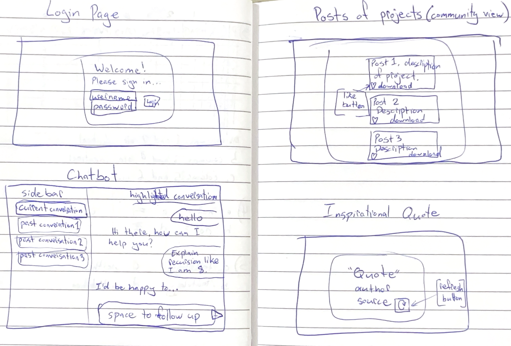

# startup

A repo for my Date Roulette website.

## Elevator Pitch
Ever have trouble coming up with a good plan for a date? Whether going on a first date or the 100th, it can be difficult to decide what to do for food, for an activity, or even which movie to pick. Your Date Roulette can help you decide what to do in just minutes! You can make custom spinners with ideas for what to do. You can save these ideas and come back to them later, improving spinners over time as you try out different ideas.

## Diagrams

## More detailed description
... more details here ...

## Technologies I will use:
... needs updating ...
- **HTML** - Uses correct HTML structure for application. Four HTML pages. One for login, one for chatting with the bot, one for viewing recent posts of students' projects, and one for viewing a programming-related inspirational quote.
- **CSS** - Application styling that looks good on different screen sizes, uses good whitespace, color choice and contrast. Little animations on the login and quote pages to make them more visually appealing.
- **React** - Provides login, previous chat display, handles API requests and responses to ChatGPT, display posts of others' projects, backend endpoint calls. Single page application with views componentized and reactive to user's actions.
- **Service** - Backend service with endpoints for:
  - logging in with username and password
  - retrieving old chats (based on user)
  - saving current chat
  - retrieving posts
  - adding new posts
  - displayed a random quote using the https://programming-quotes-api.azurewebsites.net/api/quotes/random API
- **DB/Login** - Store users, chats, and posts in database. Register and login users. Credentials securely stored in database. Can't chat with bot or view posts unless authenticated.
- **WebSocket** - As soon as a new project is posted, all users can see the post get added to the feed.